# H1 - My Linux

This is homework assignments H1 of the course 
https://terokarvinen.com/linux-palvelimet/

## Contents

- 🐧 [H1 - My Linux](#h1---my-linux)
- 🧭 [Tasks](#tasks)
- 🧠 [X - Read and summarize](#x---read-and-summarize)
- 💻 [A - Install Linux on a VM](#a---install-linux-on-a-vm)
  - 📥 [Getting the image](#getting-the-image)
  - 🧰 [Virtualbox VM](#virtualbox-vm)
  - ⚙️ [Calamares installer](#calamares-installer)
- 🧑‍💻 [K - Linux app](#k---linux-app)
- 📚 [Resources](#resources)

## Tasks:

x) Read and summarize (A few lines of French from each article will suffice. There is no need to do any tests on a computer in this section)
Writing a report
a) Install Linux on a virtual machine. (Make a new virtual machine for the report, even if you have installed it before)
k) Optional bonus: my favorite program on Linux. Perform and report a simple operation using a Linux program of your choice.

## X - Read and summarize

How to write a report by Tero Karvinen
(https://terokarvinen.com/2006/raportin-kirjoittaminen-4/)

- An article about writing reports, specifically assignments on courses via Laksy.

- Good reports are precise, easy to read, contains commands used, so that someone can follow the report and replicate what  you did.

- Also write reports about stuff that did not work.

- Remember to mention tools used and cite the sources 

## A - Install Linux on a VM

### Getting the image

I started off with downloading the new debian 13 live from:

https://cdimage.debian.org/debian-cd/13.0.0-live/amd64/iso-hybrid/

I chose the `debian-live-13.0.0-amd64-xfce.iso` version.

### Virtualbox VM

Im using virtualbox with following steps to create a new VM.

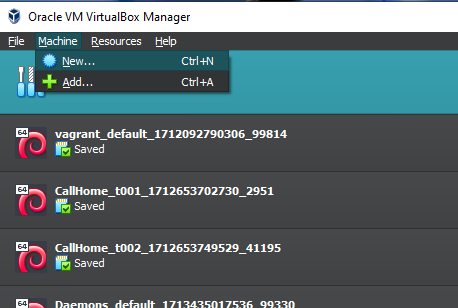

Choosing the image we just downloaded:

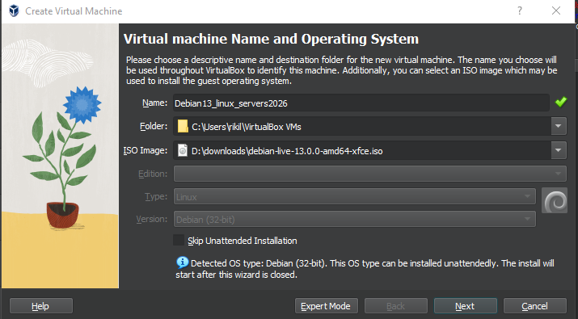

Assign username/pw

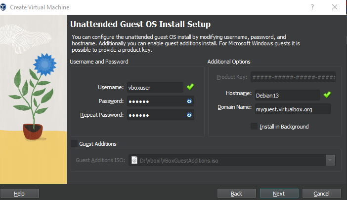

Next step I added some extra cpu & memory

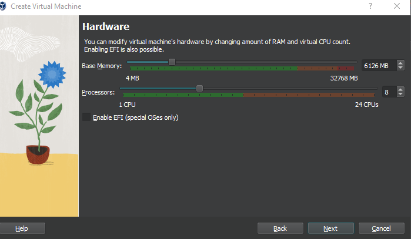

20gb should be fine for now:

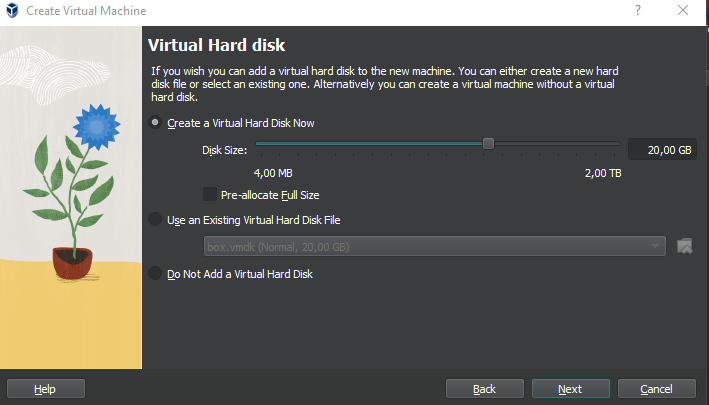

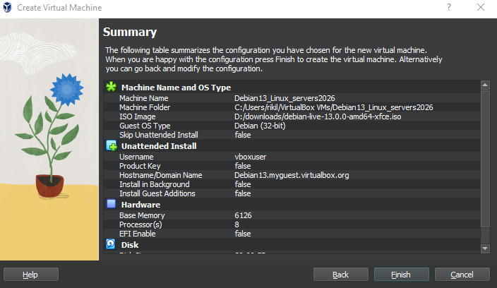

Booting up the live system

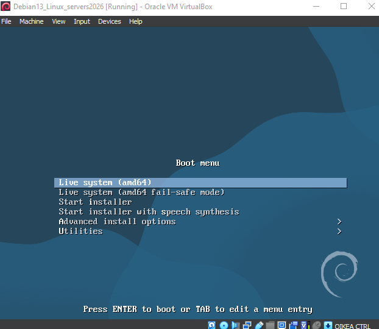

Here i got an error about 64bit system, went back to my new VM settings and changed OS to Other Linux (64bit)

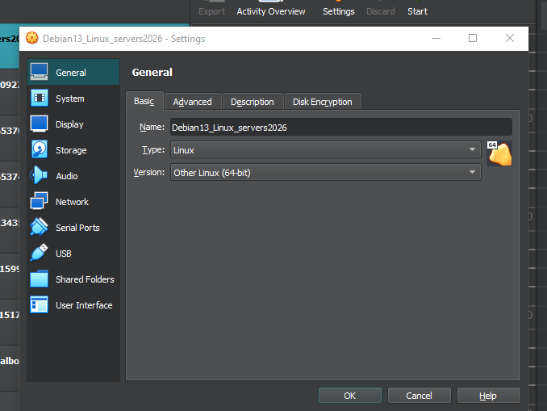

### Calamares installer

Using calamares installer inside the live image to install Debian 13.

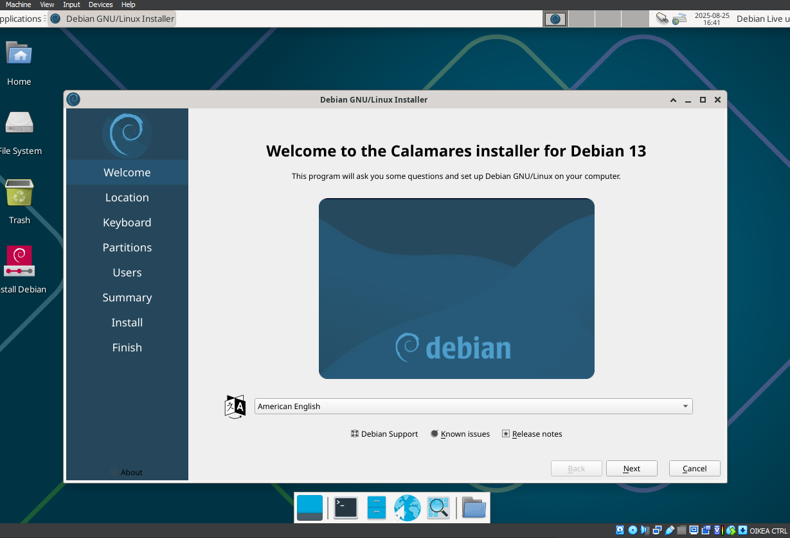

Chose all the localization settings, and default disk settings, assigned username and pw. then started installation.

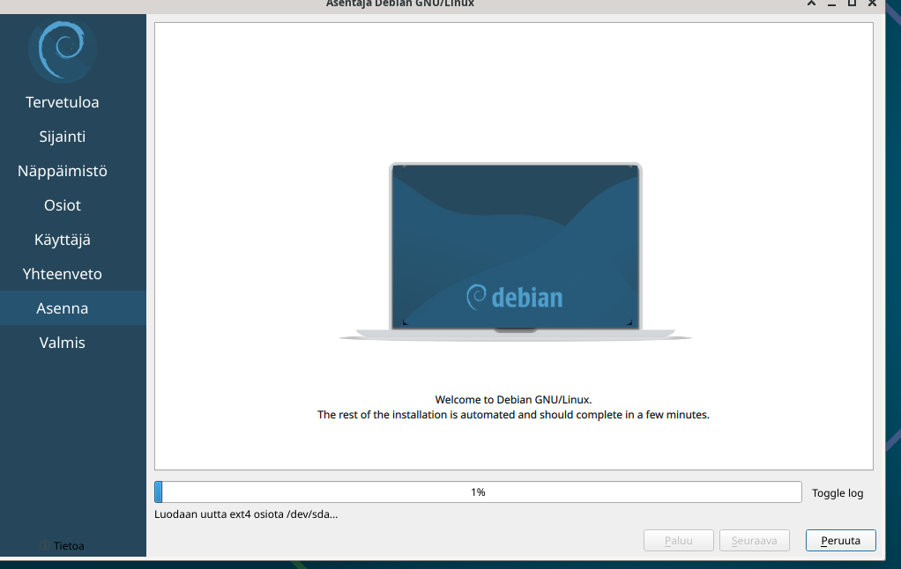

When installer completed, i chose reboot.

New install is now up.

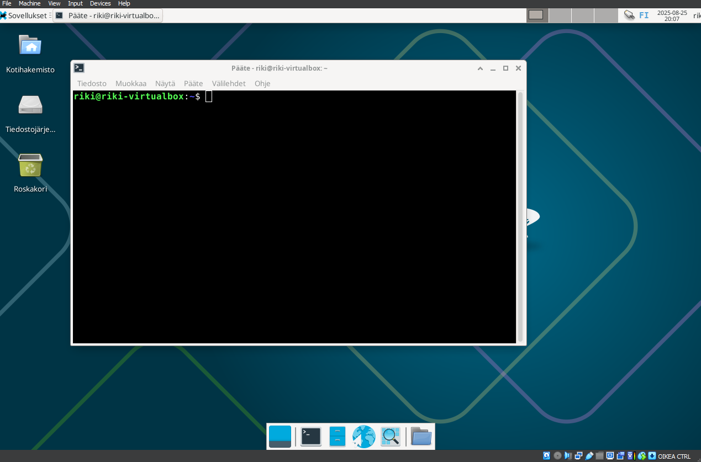

## K - Linux app

My favourite part of linux is the terminal, and the package installer apt-get.

example:
`sudo apt-get update`

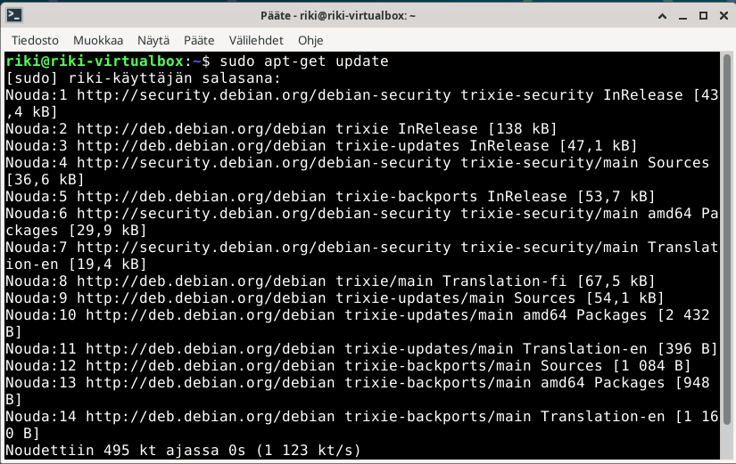

## Resources

https://github.com/johannaheinonen/johanna-test-repo/blob/main/linux-20082025.md
(Johanna Heinonen 2025)

https://terokarvinen.com/linux-palvelimet/
(Tero Karvinen 2025)

https://terokarvinen.com/2006/raportin-kirjoittaminen-4/
(Tero Karvinen 2006)