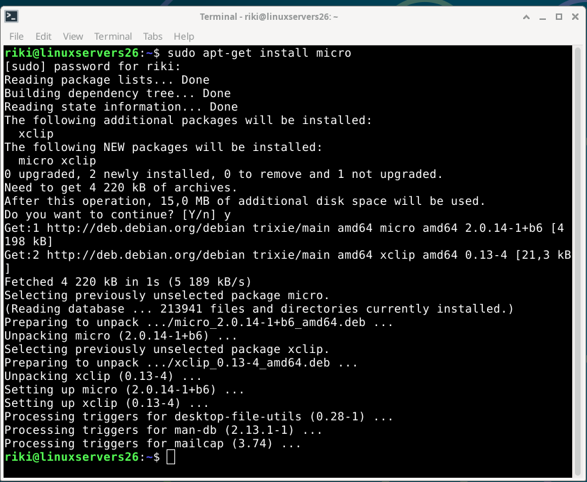

# H2 - Commander Penguin

## ToC

- [X - Command Line Basics](#x---command-line-basics)
- [A - Micro](#a---micro)
- [B - APT](#b---apt)
- [C - Important Directories](#c---important-directories)
  - [The root dir /](#the-root-dir-)
  - [Home directory](#home-directory)
  - [users home directory](#users-home-directory)
  - [/etc/ folder](#etc-folder)
  - [/media/ folder](#media-folder)
  - [/var/log/ the logs](#varlog-the-logs)
- [D - grep](#d---grep)
- [E - Pipes](#e---pipes)
- [F - lshw](#f---lshw)
- [G - Logs](#g---logs)
  - [apt logs](#apt-logs)
  - [journalctl](#journalctl)
- [H - micro addons / plugins](#h---micro-addons--plugins)
- [Tools used](#tools-used)
- [Resources](#resources)


## X - Command Line Basics

https://terokarvinen.com/2020/command-line-basics-revisited

An article with basic useful commands for linux and BSD

Some basic commands:

`pwd`
*shows current directory*

`ls`
*list files in current directory*

`cd foldeR/`
*enters foldeR/*

Updating the system with package manager

`sudo apt-get update`

`sudo apt-get upgrade`

---

## A - Micro

To install micro text editor I use the following command:

`sudo apt-get install micro`



To start micro

`micro`

or to open file or create file with micro:

`micro filename`


---

## B - APT

Install 3 apps with apt.

Im going to install irc client irssi, screen and lynx

`sudo apt-get install irssi screen lynx`


First ill try lynx, its a terminal browser

`lynx`


to open a page `g` and then type the url, for example terokarvinen.com


`Q` to quit.

Then ill open irssi with screen

`screen irssi`


screen starts a session that stays open even if we close the window, and we can later re-attach back to the screen with screen -r

irssi is just an IRC client.

---

## C - Important Directories

### The root dir /

this is the root for all folders.

to access it:
`cd /`


### Home directory

to access home directory, its the place where all users have their own home directories, for my instance, i just have my own user:

`cd /home/`


### users home directory 

to access the users home directory, the default area for new documents or downloaded files.

`cd ~`

or

`cd /home/username`


### /etc/ folder

/etc/ is the place for system settings, and other stuff such as passwords..

to enter:
`cd /etc/`


As an example, i will edit the "message of the day" file

`micro motd`


Added "Hello world!" to the motd


### /media/ folder

this is the place for removable media such as usb sticks

to access
`cd /media/`


we dont have any medias connected to the virtual machine, so this is empty.

I tested adding an sdcard/usb stick combo and it showed up.


### /var/log/ the logs

/var/log/ is the logs location


some logs require sudo, for example boot.log

`sudo cat boot.log`


---

## D - grep

grep is a tool to search for strings, some examples

Search for the string "Hello", recursively inside /etc

`sudo grep -r "Hello" /etc`


For a slightly cleaner view, only show the file names containgin "Hello" recursively on /etc, we can use:

`sudo grep -r -l "Hello" /etc`


---

## E - Pipes

For a very basic pipe command, we can combine cat with grep:


Ddo we find the line with "Hello" when using the command `cat motd`?

`cat motd | grep "Hello"`


another example, decode base64 with echo


---

## F - lshw

lshw shows system specs / components or virtual devices etc. It shows the H/W Path, device name, class and description fields.

example command:

`sudo lshw -short -sanitize`


it was not installed so we install it with the following command:

`sudo apt-get install lshw`

now we can use the command:

`sudo lshw -short -sanitize`


it shows that we are using VirtualBox, we have assigned 5632mb memory to the vm, our processor is amd 5900X.

---

## G - Logs

### apt logs

Our vm has not gathered much logs yet, but we know we used apt, so we can check the apt logs, to check the latest changes.

`cat /var/log/apt/history.log | tail`


We can confirm this is correct, since these apps we just installed. The logs show when the install was started, when it was completed, who initiated the install and what command was used, and what was installed.

### journalctl

To check the **journalctl** logs we can use the `journalctl` command, its similiar to the event viewer on windows systems.

some example parameters for `journalctl`

`-b ` shows logs since last boot

`-f` "follow" shows live log

we know we installed irssi recently, lets see if we can find a log in journalctl

`sudo journalctl -b | grep "irssi"`


---

## H - micro addons / plugins

I have previously also installed some of these, but to install i go back to previous guide / examples at:
 https://terokarvinen.com/2022/command-palette-cheatsheet-run-and-make-micro/

To install all the plugins in the guide:

```
micro --plugin install jump
cd .config/micro/plug/
git clone https://github.com/terokarvinen/palettero.git
git clone https://github.com/terokarvinen/micro-run.git
git clone https://github.com/terokarvinen/micro-cheat.git
```

testing the **run** plugin with python hello world


Pressing `F5` runs the app, and pressing `Enter` returns back to micro.


---

## Tools used

- micro
- virtualbox
- debian

---

## Resources

https://terokarvinen.com/2022/command-palette-cheatsheet-run-and-make-micro/
(tero karvinen 2022)


https://terokarvinen.com/linux-palvelimet/
(tero karvinen 2025)

https://terokarvinen.com/2020/command-line-basics-revisited
(tero karvinen 2020)