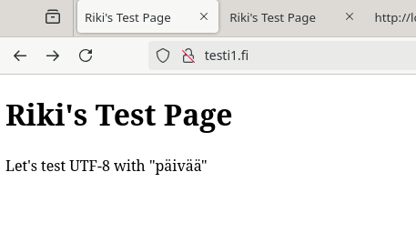

# H3 - Hello web server

In this tasks we learn about setting up Apache2 locally.

## Table of contents


- [X - Summarizing articles](#x---summarizing-articles)
  - [Apache Docs: name-based virtual host support](#apache-docs-name-based-virtual-host-support)
  - [Karvinen 2018: Name Based Virtual Hosts on Apache](#karvinen-2018-name-based-virtual-hosts-on-apache)
- [A - Installing and testing apache](#a---installing-and-testing-apache)
- [B - Logs](#b---logs)
- [C - New name based site](#c---new-name-based-site)
- [E - Valid html5 site](#e---valid-html5-site)
- [F - curl -I and curl](#f---curl--i-and-curl)
  - [Curl -I](#curl--i)
  - [curl localhost](#curl-localhost)
- [M - Github education](#m---github-education)
- [O - Dual sites](#o---dual-sites)
- [Resources](#resources)

## X - Summarizing articles

### Apache Docs: name-based virtual host support

https://httpd.apache.org/docs/2.4/vhosts/name-based.html#page-header

Its an article on how to setup virtualhosts in httpd.conf.

- IP Based hosting: Theres only one domain per ip.
- Name based hosting: Several domains/subdomains can be hosted on the same ip address, if correctly configured.

### Karvinen 2018: Name Based Virtual Hosts on Apache

https://terokarvinen.com/2018/04/10/name-based-virtual-hosts-on-apache-multiple-websites-to-single-ip-address/

- A cheatsheet guide on how to setup name based virtual hosting
- How to configre web server, setting up vhosts, creating pages as normal user.
- Also covers how to setup /etc/hosts file for testing and simulate dns locally

## A - Installing and testing apache

To install apache, we use the command:

`sudo apt-get install apache2`


lets check the status:


server seems to be up, lets confirm with curl we can access it:

`curl localhost`


It works!

## B - Logs

Checking the access logs we see that we opened the site with curl

`sudo cat /var/log/apache2/access.log`


Visible is date, time, request type: "GET HTTP", 200 for OK and our "browser" was curl.

This was not such a good example, so i open the site with firefox and check the logs again;

`sudo cat /var/log/apache2/access.log`


We see 3 new rows from a single page opening, it uses 3 GET requests, the http, the openlogo-75.png and the favicon.ico.

**Now we get some more information:**
it shows **timestamp**, **OS** identifier, **ip** address, **browser** used and version (firefox), what url was accessed.

---

## C - New name based site

creating a new conf file in sites-available:


Creating new directory "www" inside /home/riki, and creating a simple testpage helloworld index.html file inside the www folder.


enabling the site with a2ensite:

`sudo a2ensite testi1.fi`

reloading apache with

`sudo systemctl reload apache2`

Editing hosts file to add dns settings, then testing the site


now the site works on both localhost and testi1.fi dns

## E - Valid html5 site

Using the example html5 site code modified from https://terokarvinen.com/2012/short-html5-page/

Using the validator linked in the article, it has a "warning" about language declaration. And a notification about a trailing slash:


To fix this i add the lang="fi" part inside html tag, and remove the trailing slash from charset.

`<html lang="fi">`

Full code:

```
<!doctype html>
<html lang="fi">
<head>
	<title>Riki's Test Page</title>
	<meta charset="utf-8">
</head>
<body>
	<h1>Riki's Test Page</h1>
	<p>Let's test UTF-8 with "päivää"</p>
</body>
</html>
```

Now the validator passes with no warnings or errors:


Now after eiding my index.html and opening the page, it asks for translation since it sees the "fi" lang, but i just cancel it and open the page:



**Test works!**

## F - curl -I and curl

### Curl -I


Curl -I provides headers info from the server

`HTTP 200 OK` What protocol, status code 200, OK

`Date` here is the server timestamp

`Server` the web server used, and os

`Last-Modified` when the index file was modified.

`ETag` "entity tag" Its a hash for the file, used to check if we need to download it again https://en.wikipedia.org/wiki/HTTP_ETag

`Accept-Ranges` : bytes seems to be the only formal range https://developer.mozilla.org/en-US/docs/Web/HTTP/Reference/Headers/Accept-Ranges

`Content-Length` size of the response (index.html)

`Vary` Accept-Encoding, describes parts of the request message:
https://developer.mozilla.org/en-US/docs/Web/HTTP/Reference/Headers/Vary

`Content-Type:` text/html this indicates the content is html

### curl localhost

`curl localhost`

this prints the localhost website index content(source)


## M - Github education

Adding the education package to existing github account

First add the education email to the account in github.com/settings/emails


Then verify email address from inbox.

Start application process from

https://github.com/education

Confirm school, for me it was automatically detected.

Add proof


Submit application:


Application was denied since i was too far from campus, i had to spoof the geolocation to 60.201444, 24.934394 (Pasila campus)


## O - Dual sites

Creating new conf, linuxservers.fi.conf


creating the directory and a simple index.html inside it

/home/riki/linuxservers

enabling the site:

`sudo a2ensite linuxservers.fi.conf`

`sudo systemctl reload apache2`


it works!


## Resources

https://github.com/education

https://en.wikipedia.org/wiki/HTTP_ETag

https://developer.mozilla.org/en-US/docs/Web/HTTP/Reference/Headers/Vary

https://developer.mozilla.org/en-US/docs/Web/HTTP/Reference/Headers/Accept-Ranges

https://httpd.apache.org/docs/2.4/vhosts/name-based.html

https://terokarvinen.com/2018/04/10/name-based-virtual-hosts-on-apache-multiple-websites-to-single-ip-address/

https://terokarvinen.com/linux-palvelimet/

https://terokarvinen.com/2012/short-html5-page/

https://www.w3.org/International/techniques/authoring-html.en?open=language&open=textprocessing#textprocessing

https://validator.w3.org/